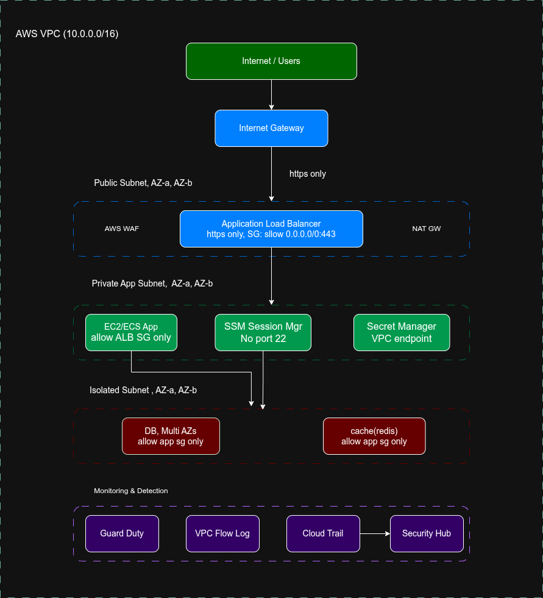

# AWS Networking Lab - Production Style Multi-AZ Network Architecture

A production-inspired AWS networking architecture designed to understand VPC design, subnet segmentation, high availability, and network isolation best practices.

---

## Architecture Diagram

<p align="center">
  
</p>

---

## Project Overview

This project demonstrates the design and implementation of a scalable AWS network architecture using:

- Virtual Private Cloud (VPC)
- Public Subnets
- Private Subnets
- Isolated Database Subnets
- Multi-AZ Deployment
- DNS Configuration
- Network Segmentation

The architecture follows industry-standard practices by separating internet-facing resources, application workloads, and database resources into dedicated network tiers.

---

## Architecture Goals

- Build a secure and isolated AWS network
- Design a highly available multi-AZ environment
- Separate infrastructure into logical tiers
- Prepare the foundation for production workloads
- Enable future scalability without network redesign

---

## VPC Configuration

| Configuration | Value |
|:-------------|:------|
| VPC Name | prod-vpc |
| CIDR Block | 10.0.0.0/16 |
| IPv6 | Disabled |
| DNS Resolution | Enabled |
| DNS Hostnames | Enabled |
| Tenancy | Default |

---

## Network Layout

### VPC CIDR

```text
10.0.0.0/16
```

### Subnet Allocation

| Tier | Availability Zone | CIDR Block |
|:------|:------|:------|
| Public | ap-south-1a | 10.0.1.0/24 |
| Public | ap-south-1b | 10.0.2.0/24 |
| Private | ap-south-1a | 10.0.11.0/24 |
| Private | ap-south-1b | 10.0.12.0/24 |
| Isolated | ap-south-1a | 10.0.21.0/24 |
| Isolated | ap-south-1b | 10.0.22.0/24 |

---

## Network Segmentation Strategy

### Public Layer

Internet-facing resources are deployed in public subnets.

Examples:

- Application Load Balancer (ALB)
- Bastion Host
- NAT Gateway

CIDR Blocks:

```text
10.0.1.0/24
10.0.2.0/24
```

---

### Private Layer

Application workloads are deployed in private subnets.

Examples:

- Node.js Applications
- Backend APIs
- Microservices
- ECS Tasks
- EKS Worker Nodes

CIDR Blocks:

```text
10.0.11.0/24
10.0.12.0/24
```

---

### Isolated Layer

Database resources are deployed in isolated subnets with no direct internet access.

Examples:

- PostgreSQL
- MySQL
- Redis
- Internal Services

CIDR Blocks:

```text
10.0.21.0/24
10.0.22.0/24
```

---

## High Availability Design

The architecture spans two Availability Zones:

- ap-south-1a
- ap-south-1b

Benefits:

- Improved fault tolerance
- Reduced single points of failure
- Better workload distribution
- Production-ready architecture pattern

---

## Design Decisions

### Why a /16 CIDR Block?

```text
10.0.0.0/16
```

Provides approximately 65,536 IP addresses, allowing future expansion without redesigning the network.

---

### Why Separate Public, Private, and Isolated Tiers?

This approach improves:

- Security
- Maintainability
- Resource Isolation
- Compliance Readiness

Only internet-facing components are placed in public subnets.

---

### Why Leave Gaps Between Subnet Ranges?

Current allocation:

```text
Public   : 10.0.1.0/24 - 10.0.2.0/24

Private  : 10.0.11.0/24 - 10.0.12.0/24

Isolated : 10.0.21.0/24 - 10.0.22.0/24
```

This strategy allows future subnet expansion without overlapping existing address ranges.

---

## Resources Created

| Resource | Count |
|:----------|:------|
| VPC | 1 |
| Public Subnets | 2 |
| Private Subnets | 2 |
| Isolated Subnets | 2 |
| Availability Zones | 2 |

---

## Key Learnings

Through this project I gained hands-on experience with:

- AWS VPC Design
- CIDR Planning
- Multi-AZ Networking
- Public vs Private Networking
- DNS Configuration
- Network Segmentation
- Infrastructure Planning
- Production Architecture Fundamentals

---

## Future Enhancements

The following components will be added in upcoming phases:

- Internet Gateway
- Route Tables
- NAT Gateway
- Security Groups
- Network ACLs
- Application Load Balancer
- EC2 Instances
- RDS PostgreSQL
- Monitoring and Logging

---

## Technologies Used

- AWS VPC
- AWS Subnets
- AWS Route Tables
- AWS Internet Gateway
- AWS NAT Gateway
- AWS Security Groups
- AWS RDS
- AWS EC2

---

## Author

**Himanshu Sah**

Backend Developer | Cloud & Infrastructure Enthusiast

Currently learning AWS architecture, Kubernetes, distributed systems, and production-grade infrastructure design.